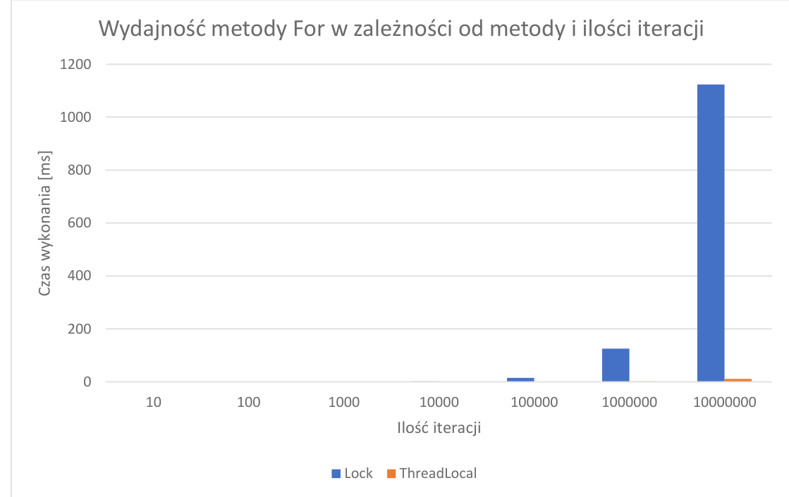

# Genesis
The code is based on my master's thesis. Performance and synchronization aspects in .NET multithreading applications

# Technologi used
- .NET
- Multithreading
- Synchronization

# Example

